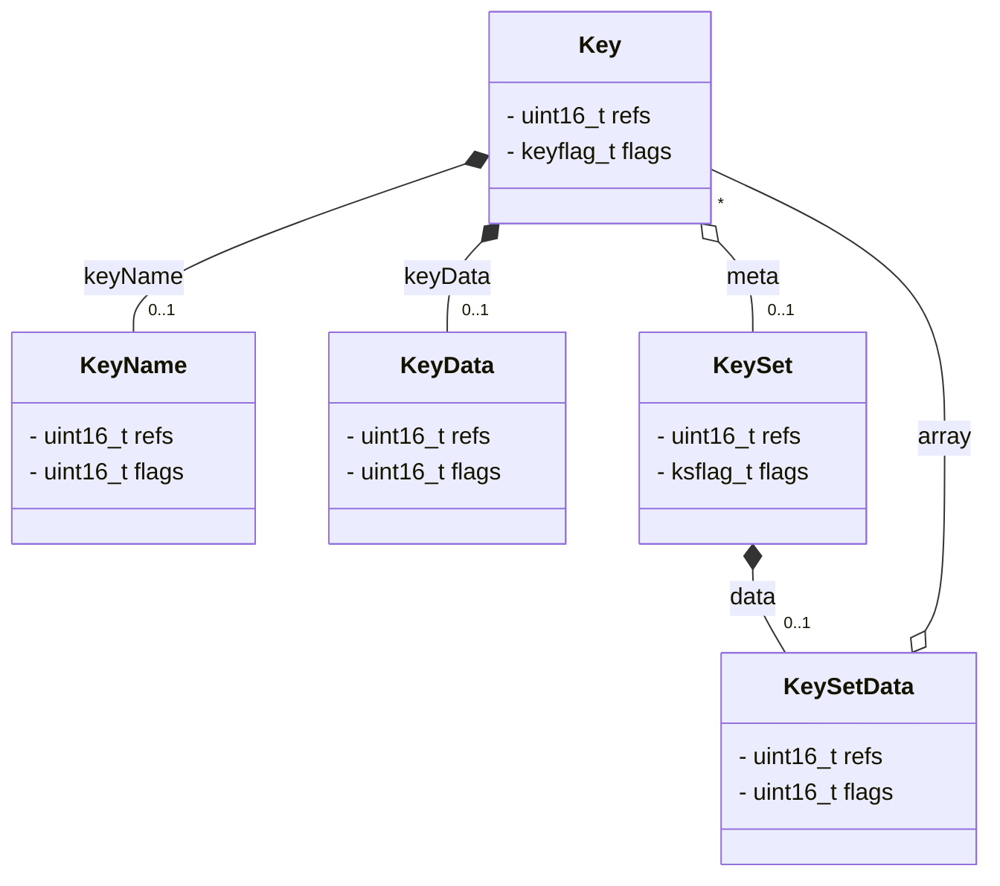

# Copy-on-Write

The two basic Elektra datastructures `Key` and `KeySet` implement full copy-on-write (COW) functionality.
If a key or a keyset gets copied, only a shallow copy with references to the original name and value is created.
Only if it gets modified the necessary memory is actually allocated.
As a consequence, duplicated keys or keysets only require a fraction of the memory compared to their source counterparts.

## Working principle

The main principle for the copy-on-write approach is simple: seperate the "real" data from the user-facing identifying entity, in our case `Key` and `KeySet`.
Developers using Elektra only get references to `Key` and `KeySet` objects.
Those objects themselves do not hold any data. 
They only contain references to other entities holding the data.

The main entities for copy-on-write are depicted in the following diagram:

- `Key`: logically represents a key. No real data is actually stored in it.
  - `KeyName`: holds the name of a key. May be shared between multiple `Key` objects.
  - `KeyData`: holds the value of a key. May be shared between multiple `Key` objects.
- `KeySet`: logically represents a collection of keys. No real data is actually stored in it.
  - `KeySetData`: holds an array of `Key` objects. May be shared between multiple `KeySet` objects.

When creating instances of `Key` and `KeySet` via `keyNew` or `ksNew`, we allocate the least amount.
For `Key`, we only allocate a `KeyName` entity.
For `KeySet`, we allocate no other entities.
The missing entities will get allocated when needed.

If the name of a key gets modified, we first ensure that the key is the singular "owner" of its `KeyName` entity.
It it isn't, then a new `KeyName` object is allocated for it.
Depending on the type of modification, the value of the name is also copied.
The modifications to the name are then performed on the now exclusively owned `KeyName` entity.

The same applies for the value of a key, and for keysets.

When copying the name or value of a key, or data of a keyset, via `keyCopy`, `ksCopy`, `keyDup` or `ksDup`, point the according references to the entities of the `source` object.
The reference counter of those entities is increased accordingly.
The entities of the `destination` object will get their reference count decreased, and if they reach 0 they will be `free`d.

## Reference counting

All entities are reference counted.
The reference count is stored in each entity in an unsigned 16-bit integer variable `refs`.
The special value `UINT16_MAX` is reserved as an error indicator, so the maximum number of references for each entity is `UINT16_MAX - 1` or 65534.

The reference counting mechanismns for `Key` and `KeySet` are part of the public API. The reference counting mechanismns for `KeyName`, `KeyData` and `KeySetData` are private.

A value of 0 for `KeyName`, `KeyData` and `KeySetData` is illegal, except directly after it is allocated or directly before it is going to be `free`d.

## Integration with `mmapstorage`

The `mmapstorage` plugin needs a flag for every entity to indicate whether the entity is stored via `mmap` or normally allocated via `malloc`. If an entity is flagged as being stored in `mmap`, it must **never** be freed using `free`.

The following flags are responsible for each entity:

- `Key`: `KEY_FLAG_MMAP_STRUCT` is set on the `flags` field
- `KeyName`: `KEY_FLAG_MMAP_KEY` is set on the `flags` field
- `KeyData`: `KS_FLAG_MMAP_Data` is set on the `flags` field
- `KeySet`: `KS_FLAG_MMAP_STRUCT` is set on the `flags` field
- `KeySetData`: `KS_FLAG_MMAP_ARRAY` is set on the `flags` field
