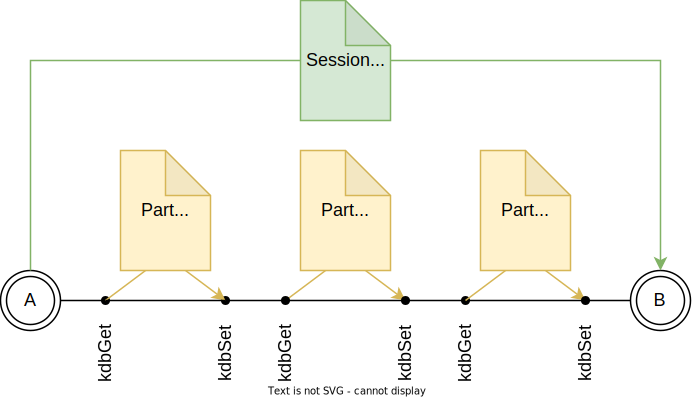
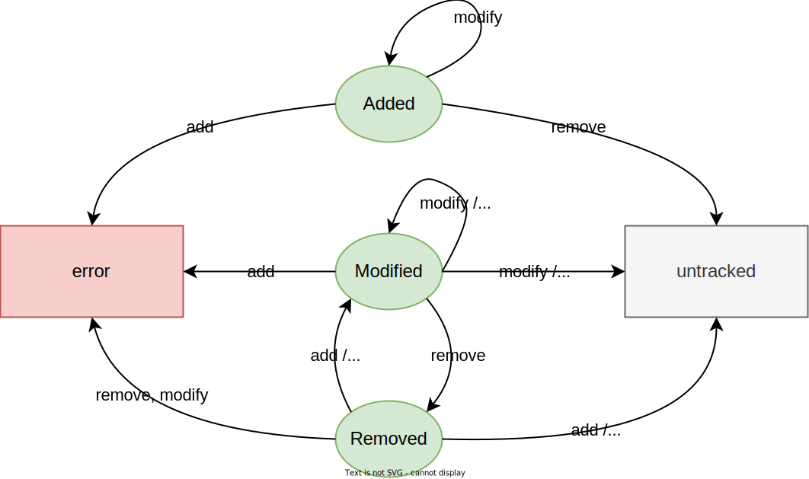

# Session Recording Technical Documentation

The purpose of this document is to explain in detail the concepts and implementation of Elektra's session recording feature.
While the feature is under development, it acts as sort of in-between documentation, roadmap and TODO list.


## What is Session Recording?

After every `kdbSet` action, the changes are calculated using Elektra's powerful changetracking API.
The result of the calculation is an `ElektraDiff` instance we'll call _part diff_ throughout this document.
The session recording plugin merges those _part diffs_ together and creates and persists an overall _session diff_.
Importantly, the _session diff_ is persisted cross-process.
Conceptually, this is depicted in the following image.



The following namespaces are monitored for changes:
- dir
- system
- user
- spec (?)

## Storage of the Session Diff

The session diff is persisted in the respective namespace under `/elektra/record/session`.
I.e. all keys in the diff of the `system` namespace are under `system:/elektra/record/session`.

The recording plugin needs its own KDB instance to store the session diff within Elektra.
For concurrency and performance reasons, the storage should be a separately mounted file under each namespace.
This means we need to provide default mountpoints for the 
- `dir:/elektra/record/session`,
- `system:/elektra/record/session` and
- `user:/elektra/record/session`
keys.

The following list describes some important keys:
- `/elektra/record`
- `/elektra/record/settings`
- `/elektra/record/settings/active` 
  - If the key is present, session recording is active.
  - The keys value is the parent key
- `/elektra/record/settings/export/ansible/template`
  - Optional. If we want to perform in-place updates of Ansible files, this key stores the last-used Ansible file.
- `/elektra/record/session`
  - Contains all the recorded data.
  - Should be mounted into separate files in each namespace.
- `/elektra/record/session/assert`
  - Keys that should be asserted
- `/elektra/record/session/diff`
- `/elektra/record/session/diff/added`
- `/elektra/record/session/diff/modified`
  - Contains the _old_ values and metadata for the keys that have been modified 
- `/elektra/record/session/diff/removed`
- `/elektra/record/session/new`
  - Contains the _new_ values and metadata for the keys that have been modified


## Calculating the Session Diff

Keys in a diff are divided in different categories:
- Added: the key is new and did not exist before
- Modified: the key existed before but its value (or metadata) has been modified
- Removed: the key has been deleted

Keys that stayed the same and therefore are not represented in a diff are called _untracked_ keys in the following paragraphs.
The diagram below visualizes the state transitions when merging diffs.
The green ovals depict the state of a key in the session diff. 
The arrows depict the actions/state of a key in the new part diff.
For example, if a key is in `Added` state in the session diff, and it is in `Removed` state in the new part diff, then the key will be untracked in the new version of the session diff.
The transitions from `untracked` to `Added`, `Modified` or `Removed` are not depicted, as they are quite trivial.



This new functionality will be implemented as `elektraDiffMerge`.

## Exporting changes

The main goal of session recording is to replicate the modified state on other machines.
Thus there is need to export and import the changes.
We provide the following export formats:
1. Commands - a series of `kdb` commands that recreate the changes
2. Ansible - an Ansible Playbook 

### Commands format

Should be self-explaintatory. Will look something like this:

```
kdb set user:/my/modified/value 123
kdb rm system:/my/removed/value
kdb meta-set user:/my/modified/meta meta:/hello world
```

### Ansible Playbook

Elektra already has its own Ansible module in the form of [ansible-libelektra](https://github.com/ElektraInitiative/ansible-libelektra).
The goal is to extend that module so that it
1. is backwards compatible with existing playbooks
2. fully supports what we need in order to make session recording work.

```yaml
- name: elektra module example
  hosts: localhost
  connection: local
  collections:
    - elektra_initiative.libelektra
  tasks:
    - name: set example fruits
      elektra:
        mountpoint: user:/tests/ansible/fruit
        keys:
          cherry:
            value: cola
            meta:
              # This adds the type metakey with value string to the key /tests/ansible/fruit/cherry
              type: string
          apple:
            value: pie
          berries:
              raspberry:
                value: pi
              blueberry:
                value: muffin
    - name: set example vegetables
      elektra:
        mountpoint: user:/tests/ansible/vegetables
        keys:
          tomato:
              value: ketchup
          potato:
              value: fries
```

Currently, the module has the following shortcomings that need to be addressed:
1. No support for deleting keys
   - Solution: add `meta:/elektra/deleted` metakeys, and let our tooling deal with it 
2. Likewise, no support for asserting that certain keys exist
   - Solution: add `meta:/elektra/assert` metakeys and let our tooling deal with it
3. Only a single namespace per task
   - This could be a problem if we want playbooks to be atomic.
     If an error occurs in a later namespace, we might want to roll back all previous namespaces too
   - TBD: is this something we want?
   - Solution: add a simple transaction concept.
     On the same level as `mountpoint` and `keys` add a field for `transaction`, where we can specify the transaction name and an action (`commit`, `rollback`, `create`, `use`).
     Keys will then not be saved directly into their mountpoints, but into a "transaction" mountpoint.
     Only when the `commit` action is specified, the keys will be moved from their transaction mountpoint to their real mountpoint.
     If there are multiple namespaces to export, the first export will use action `create`, the last `commit` and all inbetween `use`. 

## Architecture

The core recording feature has two main components:

1. Recording C API: Implements everything the tooling needs.
2. Recording Plugin: Gets loaded as a hook plugin, calculates the changes and persists the diff.

Furthermore, for the export we'll have two plugins. One for the Playbook and one for the Commands format.
