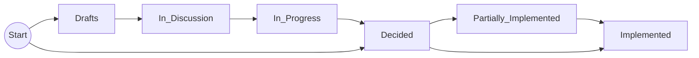

# Steps

This document describes all steps a decision can run through.

Additionally, decision that are not yet "Decided" can be become "Rejected" or "Delayed" at any point.

> The first PR for a decision must always create the decision in the "Draft" state.
> If during the reviews of this PR it becomes clear that the decision is further along, can be moved to "In Discussion" or "In Progress" before the merge.

## Drafts

> This step is recommended if the problem is not yet clear to the core developers.

The first step is to create a PR with:

- **one** decision, where at least the "Problem" is filled out and "Decision", "Rationale" and "Implications" are **not** yet filled out.
- a link from [README.md](../README.md) from the "Drafts" section to this decision.
- optional backlinks from related decisions.

> Everyone must agree that the problem exists so that a decision PR in "Drafts" step can be merged.
> At least the problem must be clear to everyone involved before the decision can leave the "Drafts" step.
> It must be so clear that everyone would be able to describe a test case that shows if a solution fixes the problem.

## In Discussion

> This step is recommended if it is not yet clear to the core developers which solution is the best.

Here you must ensure:

- problem, constraint and assumptions are well-explained and sound
- consistency with other decisions
- links from/to related decisions are created
- there are several considered alternatives, each with rationale and implication
- "Decision", "Rationale" and "Implications" are **not** yet filled out if there are people arguing for different options

Here the decision should not only have one decision but should describe several solutions.
For each solution a proposal, rationale and optionally implications should be given.

## In Progress

- You must include all further alternative proposals made in the "Considered Alternatives" section.
- Now it is allowed to have the decision from the previous round in the "Decision" section.

## Decided

> This step is mandatory.
> I.e., there must be a decision PR that puts the decision into "Decided".

- "Decision", "Rationale" and "Implications" are now filled out and fixed according to the reviews
- decisions of this step usually already have an implementation PR

> In this step, decision PRs only modify a _single_ decision.
> Only exceptions like backlinks from other decisions are allowed.

## Partially Implemented

This can be useful for decisions that need to be done for every module like plugin or library.
It is for decisions where only a few not-so-important modules are missing and/or issues exist for the remaining pieces.

The "Implication" must clearly say how much of the decision is already implemented.

## Implemented

> This step is mandatory.
> I.e., there must be a decision PR that puts the decision into "Implemented".

- Here the details of the decisions are stripped from the decision and moved to the documentation.
- The documentation links to the decision.
- The decision links to the new documentation.

> In this step, decision PRs only modify a _single_ decision.
> Here more exceptions are allowed, in particular documentation updates concerning the decision.

## Rejected

Alternatively, decisions might be rejected (i.e. status quo wins).
These decision PRs are also merged for documentation purposes.
