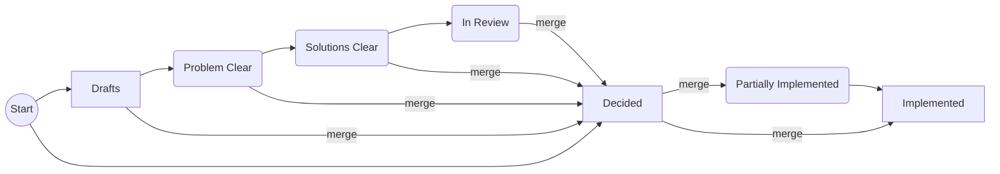

# Steps

This document describes all steps a decision can run through.

Additionally, decision that are not yet "Decided" may be become "Drafts", "Rejected" or "Postponed" at any point, e.g., if the decision author stops working on the decision.

The label `merge` on the edges means that a decision PR must be merged before it can target the next step.

> The first PR for a decision usually creates the decision in the "Drafts" state.
> If during the reviews of this PR it becomes clear that the decision is further along, can be moved to "Problem Clear", "Solutions Clear" or even "In Review" before the merge.

Short summary:

1. The first PR for a decision is created as "Drafts" (recommended!), "Problem Clear", "Solutions Clear" or "Decided".
2. A decision PR that wants to merge a decision as "Decided" must:
   1. Only contain changes to one decision.
   2. Already start with the decision as "Decided".
   3. Already have a clearly stated problem and all the solutions fully explored.
   4. Only contain discussions/reviews about deciding between one of the solutions or details thereof.
   5. If there is any change in the direction of the decision then the PR cannot be merged as "Decided". The decision must at least be moved back to "In Review".
3. After a decision is merged as "Decided", it can be moved to "Partially Implemented" or "Implemented" by any PR.

The rest of the document describes the steps in full details.

## Drafts

> This step is highly recommended and it is even required if the problem is not yet clear to all the core developers.

The first step is to create a PR with:

- **one** decision, where at least the "Problem" is filled out and "Decision", "Rationale" and "Implications" are **not** yet filled out.
- optional backlinks from related decisions.

This step is brainstorming for completely new ideas.

> No agreement about anything is needed to merge decisions in this stage.

## Problem Clear

This step is very important:

- it clarifies the importance of the problem, answering:
  Why should we put our time and energy in this problem and not in another problem.
- it clarifies the scope of the decision.
- it clarifies relation to other problems.

Decisions will have much smoother further steps if this step is done carefully without prejudice.
It is especially important that one shouldn't have a fixed mind-set about a preferred solution from the beginning.

> Everyone must agree that the problem exists and is worth solving so that a decision PR in "Problem Clear" step can be merged.
> A problem is clear if everyone would be able to describe an experiment or test case that shows if a solution fixes the problem.

## Solutions Clear

> This step is recommended if it is not yet clear to the core developers which solution is the best.

Here you must ensure:

- problem, constraint and assumptions are well-explained and sound
- links from/to related decisions are created
- there are several solutions described, each with rationale and implication
- "Decision", "Rationale" and "Implications" are **not** yet filled out

Here the decision should not only have one decision but should describe several solutions.
For each solution a proposal, rationale and optionally implications should be given.

> The solutions are clear if all reviewers understand the given solutions and no reviewer can come up with better solutions.
> The solution space is clear.
> I.e. the trade-offs, combinations and pros/cons of the solutions are explored.
> Decision author and reviewers are satisfied that every useful solution is present in the decision.

## In Review

Now it is allowed to have the decision from the previous round in the "Decision" section.
In this step, the last details of the chosen decision get polished:

- consistency with other decisions
- links from/to related decisions checked
- "Decision", "Rationale" and "Implications" are fully filled out

> Without merges in between, this is the last step reachable for a decision PR that started in "Drafts".

## Decided

> This step is mandatory.
> I.e., there must be a dedicated decision PR that puts the decision into "Decided".

- "Decision", "Rationale" and "Implications" are now filled out and fixed according to the reviews
- decisions of this step usually already have an implementation PR

Decisions that need an update, e.g. because assumptions changed, sometimes directly start with the step "Decided".

> In this step, decision PRs only modify a _single_ decision.
> Only exceptions like backlinks from other decisions are allowed.

## Partially Implemented

We want to avoid this step, ideally PRs fully implement decisions.

Nevertheless, this can be useful for decisions that need to be done for every module like plugin or library.
It is for decisions where only a few not-so-important modules are missing and/or issues exist for the remaining pieces.

The "Implication" must clearly say how much of the decision is already implemented.

## Implemented

> This step is mandatory.
> I.e., there must be a decision PR that puts the decision into "Implemented".

- Here the details of the decisions are stripped from the decision and moved to the documentation.
- The documentation links to the decision.
- The decision links to the new documentation.

> In this step, decision PRs only modify a _single_ decision.
> Here more exceptions are allowed, in particular documentation updates are okay.

## Postponed

This step is:

- for decisions that would be useful contributions but there is currently nobody with the time to focus on the problem.
- a graveyard for neglected decisions, e.g., where the decision authors focus on something more important instead.

> The purpose of this step is to have a clean "Drafts" folder.

## Rejected

Alternatively, decisions might be rejected (e.g. status quo wins).
This step is for decisions for which a consensus exists that the decision should not be taken right now.
If circumstances change, the decision may be revisited.

> The purpose of this final step is to have a clean "Drafts" folder.
