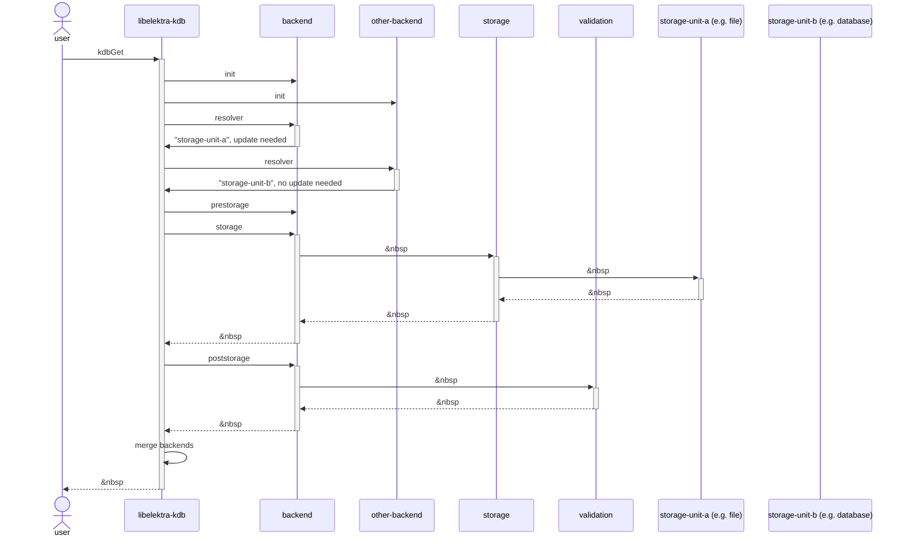
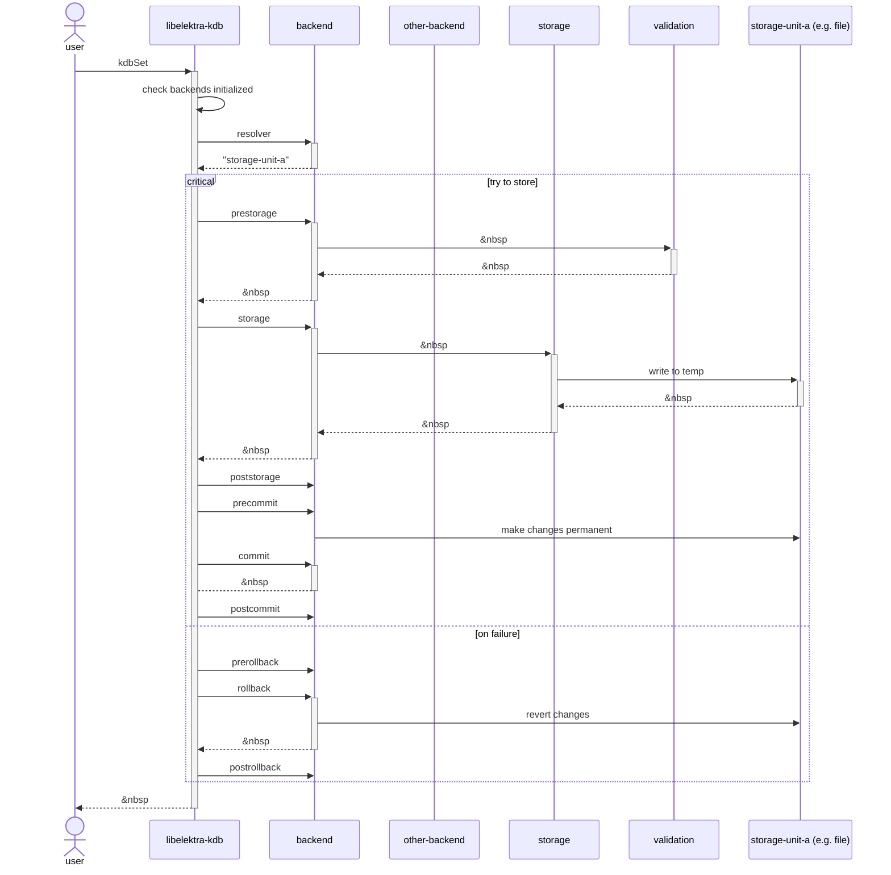

# Backend Plugins

## Backend Contract

There exists a _backend contract_ between `libelektra-kdb` and any plugin acting as a backend plugin.
This contract sets, the order of the phases described above and defines the interaction between a backend plugin and `libelektra-kdb`.

The diagrams above show possible sequences of phases during a `get` and a `set` operation.
For each of the phases of a `get` operation `libelektra-kdb` calls the backend plugin's `elektra<Plugin>Get` function once.
Similarly, for the phases of a `set` operation `elektra<Plugin>Set` is called.
The backend plugin can also (optionally) delegate to other plugins.

The current phase is communicated to the backend plugin (and any other plugin) via the global keyset.
It can be retrieved via the `elektraPluginGetPhase` function.

### `parentKey`

The key `parentKey` that is given to the backend plugin as an input at various points, must be treated carefully.
Currently, _all_ modifications to this key will be propagated to the `parentKey` that was used to call `kdbGet`.

The name of the `parentKey` is marked read-only and therefore cannot be changed.
The value and metadata can, and in some cases must be, changed.
In future this may be restricted further to ensure a more structured communication.

### Operation `get`

The `get` operation is mandatory and all backend plugins must implement it.

#### Initialization Phase

During the `init` phase the backend plugin is called with:

- A key `parentKey` whose name is the root of the mountpoint configuration (e.g. `system:/elektra/mountpoints/system:\/hosts`) and whose value is an empty string.
  The key name and value of this key are read-only.
  The name of `parentKey` is chosen to make it easier for the plugin to produce good error messages.
- A keyset `definition` containing the mountpoint definition.
  To make things easier for the plugin, keys in `definition` are renamed to be below `system:/`.
  For example, if the key `system:/elektra/mountpoints/system:\/hosts/path` is set in the KDB, then `definition` will contain a key `system:/path`.
- Additionally, the plugins for the current mountpoint are opened by `libelektra-kdb` and provided to the backend plugin via the global keyset.
  They can be accessed via the `elektraPluginFromMountpoint` function.

The backend plugin then:

- **MUST** parse the mountpoint definition and store the necessary information for later phases internally.
- **SHOULD** validate that the mountpoint definition _can be_ valid.
- **SHOULD NOT** do other validation.
  For example a file-based backend, _should not_ check whether the file(s) or path(s) referenced in the mountpoint definition exist.
  Such a check should be done in the `resolver` phase.
- **MAY** decided that the mountpoint should be read-only.
  If so, this must be indicated to `libelektra-kdb` via the return value.

This phase exists purely for the backend plugin to initialize and configure itself for the mountpoint.

> **Note**: This phase is only executed _once per instance of `KDB`_.
> Only the first `kdbGet()` call will result in `libelektra-kdb` executing this phase, all future calls to `kdbGet()` (and `kdbSet()`) start with the `resolver` phase.
> The backend plugin must store the necessary information contained in the mountpoint definition internally to accommodate this.

#### Resolver Phase

During the `resolver` phase the backend plugin is called with:

- A key `parentKey` whose name is the parent key of the mountpoint and whose value is an empty string.
  The key name of this key is read-only.
- An empty keyset `ks`.

The backend plugin then:

- **MUST** set the value of the `parentKey` to a value identifying the storage unit (the _storage identifier_) that contains the data of the mountpoint.
  For file-based backend plugins, this means setting the value of `parentKey` to an absolute filename.
- **MAY** set metadata on `parentKey`, if encoding the information required for the following phases is too hard to encode in a single string value.

> **Note**: The backend plugin may also modify the keyset `ks`, but `libelektra-kdb` will discard this keyset after this phase, so these modifications won't have any effects.

During a `set` operation the backend plugin must also ensure that errors in the storage phases can be safely rolled back and that the `set` operation does not affect concurrent operations.
For file-based backends, this means creating a temporary storage file and returning its absolute filename instead of the name of the actual storage file.
In other words, in a `set` operation the `resolver` phase is also about preparing a transaction in addition to resolving the storage unit.

#### Cache-Check Phase

Implementing this phase is optional.
If a backend plugin does not support caching, it should immediately return a value indicating that the cache is invalid.
If there is no cache entry for this backend, `libelektra-kdb` skips this phase.

During the `cachecheck` phase the backend plugin is called with:

- The exact `parentKey` that was returned by the `resolver` phase of this `get` operation.
  The key name and value of this key are read-only.
  Additionally, the metakey `internal/kdb/cachehandle` is set to a value indicating the cache handle (usually modification time) of the cache entry.
- An empty keyset `ks`.

The backend plugin then:

- **MUST** indicate via the return value, whether the cache entry for this backend is still valid.

> **Note**: The backend plugin may also modify the keyset `ks`, but `libelektra-kdb` will discard this keyset after this phase, so these modifications won't have any effects.

#### Storage Phases

These phases are responsible for reading and validating the actual data stored in the KDB.

In the `prestorage` phase the backend plugin is called with:

- The exact `parentKey` that was returned by the `resolver` phase of this `get` operation.
  The key name and value of this key are read-only.
- An empty keyset `ks`.

There are no restrictions on what the backend plugin may do in this phase, but just like in the `resolver` phase, change to `ks` will be discarded.
This phase is useful for file-level manipulations, like file-based encryption, line ending conversion or verifying file signatures.
In this sense, it is the counter-part of the `precommit` phase of the `set` operation.

The `storage` phase is the where the actual data is read.
In this phase the backend plugin is called with:

- The exact `parentKey` that was returned by the `prestorage` phase of this `get` operation.
  The key name and value of this key are read-only.
- An empty keyset `ks`.

The backend plugin then:

- **MUST** read the data for the mountpoint from the storage unit that was selected in the `resolver` phase.
- **MUST** parse that data and insert it below `parentKey` into `ks`.

The last of the storage phases is the `poststorage` phase.
In this phase the backend plugin is called with:

- The exact `parentKey` that was returned by the `storage` phase of this `get` operation.
  The key name and value of this key are read-only.
- The exact `ks` that was returned by the `storage` phase of this `get` operation.

Again there are no restrictions on what the backend plugin may do in this phase.
However, unlike the `prestorage` phase, this phase is a very important one.
It is where validation, generation of implicit values and similar tasks happen.

Finally, `libelektra-kdb` merges the keyset returned by the `poststorage` phase with the ones returned by other backend plugins for different mountpoints and then returns it to the user.

### Operation `set`

The `set` operation is optional.
A mountpoint is automatically read-only and doesn't support the `set` operation, if the backend plugin does not define a `elektra<Plugin>Set` function.

Alternatively, the read-only nature of the mountpoint may also be indicated by the backend plugin during the `init` phase of the `get` operation.

#### Resolver Phase

During the `resolver` phase the backend plugin is called with:

- The exact `parentKey` that was returned by the `resolver` phase of the last `get` or `set` operation.
  The key name of this key is read-only.
- An empty keyset `ks`.

The backend plugin then:

- **MUST** set the value of the `parentKey` to a value identifying the storage unit that contains the data of the mountpoint.
  For file-based backend plugins, this means setting the value of `parentKey` to an absolute filename.
- **MAY** set metadata on `parentKey`, if encoding the information required for the following phases is too hard to encode in a single string value.
- **MUST** check whether the data was changed since the last `get` operation.
  The result of this check is given to `libelektra-kdb` via the return value of the `get` function.
- **MUST** ensure that errors in the storage phases can be safely rolled back and that the `set` operation does not affect concurrent operations.
  For file-based backends, this means creating a temporary storage file and returning its absolute filename instead of the name of the actual storage file.

> **Note**: The backend plugin may also modify the keyset `ks`, but `libelektra-kdb` will discard this keyset after this phase, so these modifications won't have any effects.

#### Storage Phases

These phases are responsible for validating and writing data to the KDB.

In the `prestorage` phase the backend plugin is called with:

- The exact `parentKey` that was returned by the `resolver` phase of this `set` operation.
  The key name and value of this key are read-only.
- The exact subset below `parentKey` of the keyset `ks` that was provided by the user.

There are no restrictions on what the backend plugin may do in this phase.
This phase can be used for validation to avoid storing invalid configuration.
However, it should not be used for generating keys or values implicitly defined by other keys.
Such keys should be generated during the `poststorage` phase of a `get` operation and should actually be _removed_ again in this phase.
That way there cannot be conflicts, if a key that implies another keys value changes.

> **Note**: Just in case there is actually a use case, where keys have to be generated, removed or modified during this phase, we do _not_ discard changes to `ks` (like we would do in a `get` operation).

The `storage` phase is the where the actual data is written.
In this phase the backend plugin is called with:

- The exact `parentKey` that was returned by the `prestorage` phase of this `set` operation.
  The key name and value of this key are read-only.
- The exact keyset `ks` that was returned by the `prestorage` phase of this `set` operation.
  All keys in this keyset and the keyset itself are fully read-only.

The backend plugin then:

- **MUST** serialize the data and below `parentKey` in `ks`.
- **MUST** write the data for the mountpoint into the storage unit that was selected in the `resolver` phase.
- **MUST** ensure that the data is written in such a way that

  - it can be read, if the storage unit is mounted at another mountpoint
  - that reading such a mountpoint will result in the same data just below a different parent key

  An important implication here is that all names inside storage units should be relative to the parent key.

The last of the storage phases is the `poststorage` phase.
In this phase the backend plugin is called with:

- The exact `parentKey` that was returned by the `storage` phase of this `set` operation.
  The key name and value of this key are read-only.
- The exact keyset `ks` that was returned by the `prestorage` phase of this `set` operation.
  All keys in this keyset and the keyset itself are fully read-only.

There are no formal restrictions, other than those enforced by `parentKey` and `ks` being (partially) read-only.
But the `poststorage` phase should not be used as a counter-part to the `prestorage` phase in the `get` operation.
Use the `precommit` phase instead.
Therefore, the `poststorage` phase has very little use cases other than logging and exists mostly because of symmetry.

#### Commit Phases (`set` only)

If all storage phases completed successfully, `libelektra-kdb` will continue with calling the `commit` phases.
Even though this phase is part of the `set` operation, `libelektra-kdb` calls `elektra<Plugin>Commit` and not `elektra<Plugin>Set` for these phases.

All the `commit` phases (`precommit`, `commit`, `postcommit`) are called with:

- The exact `parentKey` that was returned by the previous phase (`poststorage`, `precommit` or `commit`) of this `set` operation.
  The key name and value of this key are read-only.
- The exact keyset `ks` that was returned by the `poststorage` phase of this `set` operation (which is the same one that was returned by the `prestorage` phase).
  All keys in this keyset and the keyset itself are fully read-only.

There are no restrictions on the `precommit` phase, other than those enforced by `parentKey` and `ks` being (partially) read-only.
This phase can be used for file-level manipulations, like file-based encryption, line ending conversion or adding file signatures.
In this sense, it is the counter-part of the `prestorage` phase of the `set` operation.

In the `commit` phase the backend plugin:

- **MUST** make the changes done during the `storage` phase of this `set` operation permanent in such a way that a following `get` operation will be able to read them (assuming there is no other `set` operation in between).

There are no restrictions on what the backend plugin may do in the `postcommit` phase.
However, it is important to keep in mind that an error in the `postcommit` phase will **not** make the `set` operation fail.
Once the `commit` phase completes successfully, the `set` operation is also deemed successful, since the changes were made permanent.
If an error does occur in the `postcommit` phase, it is reported as warning.
This makes the `postcommit` phase mostly useful for logging.

Finally, `libelektra-kdb` merges the keyset returned by the `postcommit` phase (which is still the same one that was returned by the `prestorage` phase) with the ones returned by other backend plugins for different mountpoints and then returns it to the user.

#### Rollback Phases (`set` only)

If any of the phases `prestorage`, `storage`, `poststorage`, `precommit` or `commit` fail, `libelektra-kdb` will continue with the rollback phases.
Even though this phase is part of the `set` operation, `libelektra-kdb` calls `elektra<Plugin>Error` and not `elektra<Plugin>Set` for these phases.

Similar to the commit phases, the rollback phases (`prerollback`, `rollback` and `postrollback`) are called with:

- The exact `parentKey` that was returned by the phase of this `set` operation that reported an error.
  The key name and value of this key are read-only.
- The exact keyset `ks` that was returned by the phase of this `set` operation that reported an error.
  All keys in this keyset and the keyset itself are fully read-only.

Additionally, the phase that reported an error is communicated to the backend plugin via the global keyset (together with the current phase).
The value of the key `system:/elektra/kdb/backend/failedphase` is set to the failed phase.

The `prerollback` and `postrollback` phases are mostly useful for logging.
There are no restrictions on these phase, other than those enforced by `parentKey` and `ks` being (partially) read-only.
However, they are similar to the `postcommit` phase, in that any errors they report will be ignored and reported as warnings.
In particular, even if the `prerollback` phase fails, we will `libelektra-kdb` will continue with the `rollback` phase as if `prerollback` succeeded.

In the `rollback` phase the backend plugin:

- **MUST** revert all changes made to the state of the storage unit chosen in the `resolver` phase of this `set` operation.
  For file-based backends, this means removing the temporary file.
- **MUST** ensure that a following `get` or `set` operation will act as if the failed `set` operation never happened.
- **MAY** act differently depending on which phase failed.

Finally, `libelektra-kdb` will restore `ks` to the state in which the user provided it and return.
