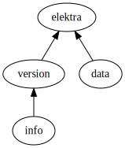

# Key Names in Elektra

## Preface

This document is a full explanation of how Key Names work in Elektra.
In addition to this document, a reference Python implementation can be found in [keynames.py](keynames.py).
The goal this Python implementation is not to be fast, or to be used in any way other than as a reference.
If there are any discrepancies between this document, the Python implementation and the actual C implementation in [src/libs/elektra/keyname.c](../../src/libs/elektra/keyname.c), you should consider them as follows:

1. The C implementation is optimized for speed and much harder to maintain.
   It is mostly likely to be incorrect.
2. In most cases, this document outranks the Python implementation.
   There may, however, be cases where the language in this document was too vague and the Python implementation is actually correct.
3. If two of the sources agree, the third one is probably incorrect.
   Although again, if one of the agreeing sources is the C implementation it could still be the case that there is a mistake.

In any case: If you find a discrepancy, please file a bug report at https://issues.libelektra.org/new.

> _Note:_ Mistakes happen.
> So there is no 100% always correct specification for Elektra's Key Names.
> The goal is only to provide a reference that has a very high likelihood of being correct.

_To Elektra Developers:_ Feel free to add any unclear or previous incorrect examples to the test cases in [tests/ctest/test_keyname.c](../../tests/ctest/test_keyname.c).
These tests are very fast (1000+ test cases per second) and the more tests the better.

## 1. Key Name Parts and Namespaces

Before we get to Key Names proper, we need to talk about Key Name Parts and Namespaces.

Each Key is part of one of these _Namespaces_:

- Cascading
- Meta
- Spec
- Proc
- Dir
- User
- System
- Default

Each of these Namespaces has a very specific meaning, explained in [another section below](#12-namespaces-and-root-keys).

Apart from the Namespace, a Key Name is just a series of zero or more _Key Name Parts_.
Each Key Name Part is just an arbitrary (possibly empty) sequence of non-zero bytes.

So without knowing anything about how Key Names are written, we could say that there is a Key in the Namespace "System" with the Key Name Parts "elektra", "version" and "info".

> _Note:_ Not every such sequence, is a valid Key Name.
> For more information see [section 4](#4-valid-and-invalid-key-names)

### 1.1. Key Hierarchy

You may have already seen elsewhere, that in Elektra Keys commonly look like Unix paths:

```
/elektra/version/info
```

> _Note:_ How this representation works exactly and how namespaces come into play, will be explained in the next section.
> For now, we only care that there is some similarity to Unix paths.

This is no mistake.
Elektra's _Key Database (KDB)_ is designed to resemble a Unix filesystem.
In particular, the KDB has a similar hierarchy.
More generally, all Key Names exhibit this hierarchy.
By going back to thinking about a Key Name as a Namespace and a series of Key Name Parts, we can define this _Key Hierarchy_.

Each Namespace has a separate hierarchy.
The relation between these, will be explored in the next section.
For now, we just look at a single Namespace.

In a Unix filesystems, we commonly talk about files and directories.
We also say a file is located within a directory.
But you might also know that in Unix "everything is a file".
This applies to directories as well, but "a file is located within a file" is a bit clunky, so you might say "file `A` is located below file `B`", if `B` is a file within the directory `A`.
What makes `A` a directory is just the fact that there can be other files below `A` [[1]](#footnote-1).
<a id="ref-footnote-1"></a>

#### 1.1.1. The "is below" Relation

This relation of "is below" is also what defines Elektra's Key Hierarchy.
Based on a Key `K` with `n` Key Name Parts, we say:

- A Key `Km` is _below_ `K`, if `Km` has `n+m` Key Name Parts and the first `n` Key Name Parts of `Km` are equal to the Key Name Parts of `K` (in the same order).
- A Key `K1` is _directly below_ `K`, if `K1` is below `K` and `K1` has `n+1` Key Name Parts.

Here are a few examples to show how this works in practice (using the Unix-path-like representation teased above):

| Key 1                   | Key 2                   | Relation                          |
| ----------------------- | ----------------------- | --------------------------------- |
| `/elektra/version/info` | `/elektra/version`      | "Key 1" is directly below "Key 2" |
| `/elektra/version/info` | `/elektra`              | "Key 1" is below "Key 2"          |
| `/elektra`              | `/elektra/version/info` | "Key 2" is below "Key 1"          |
| `/elektra/version/info` | `/elektra/version/info` | "Key 1" and "Key 2" are equal     |
| `/elektra/version/info` | `/elektra/data`         | no relation                       |
| `/elektra/data`         | `/elektra/version`      | "Key 1" and "Key 2" are siblings  |

You can think of the Key Hierarchy (within a single Namespace) as a big tree of Keys.
Each node in the tree is a single key `K` and the children of the nodes are the keys that are directly below `K`.



The diagram above shows the Key Hierarchy of the Keys in the table above (`A` -> `B` denotes `A` is directly below `B`).

> _Note:_ While we could use the directory vs. file terminology for Elektra as well, it is recommended to avoid it.
> This is because in Elektra, every Key may have an associated value.
> In particular a Key may have a value, even if there are other Keys below it.
> This value is **not**, as a beginner might suspect, the set of Keys below it, like you could say the value of a directory is the set of files (and directories) within.
> The value is just another value, like any other key would have.
>
> Instead, we recommend the terms _leaf Key_ and _non-leaf Key_, as these are commonly used for tree-like structures and their definitions fit perfectly.

#### 1.1.2. The "parent" confusion

As an inverse to "is below" we sometimes use "parent".
For example:

- `/elektra/version` is directly below `/elektra`, so `/elektra` is the (direct) parent of `/elektra/version`
- `/elektra/version/info` is below `/elektra`, so `/elektra` is a parent of `/elektra/version`
- `/elektra/version/info` and `/elektra/version` are below `/elektra`, so `/elektra` is the common parent.

This terminology can be easy to confuse, as "parent" is used for multiple different things.
If the context doesn't make it clear what "parent" means, you might consider more clear terms, e.g. other common terms for tree-like structures.
For example, you could use "ancestor" and "direct parent" as a clear differentiation.

There is also the term "(the) Parent Key".
In many cases, this is refers to a very specific Key in the given context that is a "common parent" to a certain set of Keys.
If you are working within such a context, be careful about "a parent Key" vs. "the Parent Key".

### 1.2. Namespaces and Root Keys

We mentioned above that there are different Namespaces in Elektra.
Now we will explain their meaning.

To recap, Elektra knows these Namespaces:

- Cascading
- Meta
- Spec
- Proc
- Dir
- User
- System
- Default

We mentioned above that there are Key Names with zero Key Name Parts, i.e. just Namespace.
These are called _Root Keys_ (based on Unix's filesystem root, as well as the root of a tree).

Lets explore them one by one:

- The simplest Namespace is the **"Meta"**.
  The Namespace "Meta" is used exclusively for Meta Keys, i.e. Keys that are attached to another Key as metadata.
  The Key Hierarchy of the Namespace "Meta" is entirely separate from the Key Hierarchies in the other Namespaces.
  Without external information, you cannot determine from a Key Name with Namespace "Meta", which Key this Meta Key is attached to.
- Keys with Namespace **"Proc"** only exist in memory and are scoped to the current <b>Proc</b>ess.
- Keys with Namespace **"Dir"** are scoped to a single filesystem <b>Dir</b>ectory.
  They will (normally) be stored somewhere within this directory.
  Currently, there is no way of knowing which filesystem directory a Key with Namespace "Dir" is scoped to.
  Elektra only uses Keys scoped to the Current Working Directory.
- Similarly, Keys with Namespace **"User"** are scoped to a single **User**.
  They will (normally) be stored somewhere within the User's home directory.
  Again, there is no way of knowing which user a Key is scoped to and Elektra only uses Keys scoped to the current user, i.e. the one that executed the application.
- The Namespace **"System"** is what makes Elektra global.
  Keys with Namespace "System" are the same for all users of the system, independent of context.
  They are stored in system level directory.
- Keys with Namespace **"Default"** are special.
  While you could create them manually, you normally don't want to.
  It is used for Keys with default values for Namespace Resolution (explained below).
  Keys with this Namespace are also in-memory only.
- Then there is **"Spec"**.
  This Namespace, like "Meta", is separate from the rest.
  We use it for Keys that are part of a specification used to describe other Keys.
  The Metadata of every Key with Namespace "Spec" describes a specification for the Keys that have the same Key Name Part but a different Namespace (except "Meta").
  So the Namespace "Spec" has a closer relation to the others than "Meta".
- Now just the Namespace **"Cascading"** remains.
  This Namespace is used for Namespace Resolution (see below).
  It is the one that applications and end-users will use most commonly when interacting with Elektra.
  Keys with Namespace "Cascading" are never stored.
  Not on disk and normally also not in a `KeySet`.

There is also a certain ranking between the Namespaces "Proc", "Dir", "User", "System" and "Default".
Namely, that they override each other in exactly this order.
Given two Key Names with identical Key Name Parts, but one with Namespace "Dir" and one with Namespace "User", the one with Namespace "Dir" should be considered more specific and should be preferred.

A special feature of Elektra is _Namespace Resolution_ (sometimes just Name Resolution, or Key Name Resolution).
Namespace Resolution is the process of finding an appropriate Namespace for a Key based on a Key Name with Namespace "Cascading".
It is most commonly used, when you to find which Key in the KDB should be used, based on a series of Key Name Parts.

To resolve the namespace, we just look at each of the Namespaces in the ranking defined above.
We then use the first Namespace where the Key actually exists.
Namespace Resolution is performed, when `ksLookup`/`ksLookupByName` is called with a Key Name with Namespace "Cascading" [[2]](#footnote-2).
<a id="ref-footnote-2"></a>
This is also done, if you call `kdb get` or `kdb set` with a Key Name with Namespace "Cascading".

## 2. Escaped Names

The standard way to represent a Key Name in Elektra is this:

```
system:/elektra/version/info
```

This can be deconstructed into:

- The Namespace: `system`
- The Namespace Separator: `:`
- A Part Separator: `/`
- A Key Name Part: `elektra`
- A Part Separator: `/`
- A Key Name Part: `version`
- A Part Separator: `/`
- A Key Name Part: `info`
- The invisible null terminator

> _Note:_ It might seem strange, that there is a part **separator** before the first part.
> This makes sense, because then the Part Separator always introduces a new part.
> A better fitting description would be "part introducer".
> But since we commonly call `/` a separator, we will stick to this terminology.

For Keys in the Namespace "Cascading", we omit both the Namespace itself and as well as the Namespace separator:

```
/elektra/version/info
```

We also have a special rule for the Root Keys, i.e. the Key Names with zero Key Name Parts and just a Namespace.
According to above rules `system:` would be the Escaped Name of the Root Key for the Namespace "System" and the Escaped Name for the Root Key of the Namespace "Cascading" would be an empty string.
But this is not the case.
We use `system:/` and `/` instead.
The exact details will be explored later, but for now just remember, that an (Escaped) Key Name **always** contains at least one Part Separator (`/`).

But there is a problem.
We said a Key Name part is "an arbitrary sequence of non-zero bytes".
This means "elektra/version" is a Key Name Part as well.
Since the slash `/` would conflict with the Part Separator, we can escape it with a backslash `\` (and `\` can be escaped with another `\`):

```
/elektra\/version\\/info
```

This can be deconstructed into:

- A Part Separator: `/`
- A Key Name Part: `elektra/version\`
- A Part Separator: `/`
- A Key Name Part: `info`
- An invisible null terminator

> _Note:_ When talking about a single Key Name Part `/` and `\` are never escaped.

Because of this escaping mechanism, we call this the _Escaped Name_ of a Key.

Elektra's Key Names are designed to mimic Unix paths to some extent.
To this end we support the commonly used `/.` and `/..`.
This is one reason, why we need to differentiate between _Canonical_ Key Names and _Non-Canonical_ Key Names.

### 2.1. (Non-)Canonical (Escaped) Key Names

Following the syntax of Unix paths, in Elektra both `/elektra/./version` and `/elektra/version` refer to the same Key.
Similarly, `/elektra/../version` and `/version` refer to the same Key.

To give each Key a unique Key Name, we need to introduce a _Canonical (Escaped) Key Name_.
For Unix paths, we could say that the canonical path is the shortest possible path that refers to a file.
In Elektra this doesn't quite work, but will use this definition for now.

> _Note:_ Only Escaped Key Names can be Canonical or Non-Canonical, so we normally omit the "Escaped" specifier.

Let's look at a few examples to get a feeling for Canonical and Non-Canonical Key Names.

| Non-Canonical           | Canonical          |
| ----------------------- | ------------------ |
| `/elektra/./version`    | `/elektra/version` |
| `/elektra/../version`   | `/version`         |
| `/elektra/.././version` | `/version`         |
| `/elektra///version`    | `/elektra/version` |
| `/elektra//../version`  | `/version`         |
| `/elektra/./../version` | `/elektra/version` |
| `/elektra/version/`     | `/elektra/version` |

So far this mostly follows, what we know from Unix paths.
However, the last two examples are somewhat different.

First, in Unix `/elektra/./../version` would be the same as `/version`, because `.` is just skipped and `..` removes `elektra`.
But in Elektra, we evaluate `..` first and only then skip `.`.
`/elektra/./../version` is the same as `/elektra/version`, because `..` remove `.`.

The last example is not as different, in Unix such paths would also refer to the same file.
However, in some Unix tools, a trailing slash alters the behavior of the tool.
In Elektra this is never the case.
`/elektra/version/` and `/elektra/version` refer to the same Key and are always treated as the same Key Name.
The only exception are the Root Keys.
The Canonical Key Names for the Root Keys always end with a `/`.
In fact, we will see [later](#4-valid-and-invalid-key-names), that removing the `/` makes the Key Name invalid.

There also is a completely new addition in Elektra.
Elektra has a notion of _Array Parts_.
These are Key Name Parts that denote an array index.
How exactly these work, will be explored [later](#4-valid-and-invalid-key-names).
For now, we only need to know that they start with an `#` and their canonical form has `n` underscores followed by `n+1` digits.

A few examples for Array Parts:

| Non-Canonical    | Canonical           |
| ---------------- | ------------------- |
| `/elektra/#10`   | `/elektra/#_10`     |
| `/elektra/#1234` | `/elektra/#___1234` |

### 2.2. Other Escape Sequences

We already know, that `/` and `\` have to be escaped in an Escaped Key Name.
In addition two these to, there are a few more characters that have to be escaped.
However, these additional characters may **only** be escaped at the start of a Key Name Part.

The characters in question are: `.`, `#`, `%`, `@`.
For example the Canonical Escaped Key Name for the Key with Namespace "Cascading" and Key Name Parts `elektra`, `.` and `version` is: `/elektra/\./version`.
The `\.` is the escaped form of `.`.
Using just `.` would make it a Non-Canonical Key Name, whose Canonical counterpart is `/elektra/version`, which does not have the wanted Key Name Part `.`.
Similarly, `#10` would make a Key Name Non-Canonical, but `\#10` won't.
Therefore, if you want a Canonical Key Name with a Key Name Part `#10` and not actually `#_10`,
must use e.g. `/elektra/\#10/version`.

<!-- TODO (kodebach): Unforunate escaping behavior
        Unfortunately this means that both `/elektra/.version` and `/elektra/\.version` have the same unescaped form (`elektra`, `.version`).
        The same applies to `/elektra/%version` and `/elektra/\%version`.
        All of these are, however, Canonical Key Names.
        So the Key (CASCADING, `elektra`, `.version`) actually has two canonical forms....
-->

## 3. Unescaped Names

While the Escaped Name of a Key is nice for humans, it is not very well suited for machines.
The escaping of path separators makes it hard to find the Key Name Parts of a given Key Name.
The Escaped Name is also not well suited for sorting [[3]](#footnote-3).
<a id="ref-footnote-3"></a>

Both of these flaws are solved by the _Unescaped Name_.
In Unescaped Names we use a zero-byte as the Part Separator.
Since a Key Name Part cannot contain a zero-byte, we do not need an escaping mechanism for the path separator.

However, these zero-bytes mean that the Unescaped Name is not a printable string and therefore not human-readable.
This why we will only describe the Unescaped Name in the deconstructed form.

The Escaped Names from above correspond to the following Unescaped Names:

1. `system:/elektra/version/info`
   - The byte representing the Namespace "System": `0x07`
   - A Part Separator: `0x00`
   - A Key Name Part: `elektra`
   - A Part Separator: `0x00`
   - A Key Name Part: `version`
   - A Part Separator: `0x00`
   - A Key Name Part: `info`
   - The terminator byte: `0x00`
2. `/elektra/version/info`
   - The byte representing the Namespace "Cascading": `0x01`
   - A Part Separator: `0x00`
   - A Key Name Part: `elektra`
   - A Part Separator: `0x00`
   - A Key Name Part: `version`
   - A Part Separator: `0x00`
   - A Key Name Part: `info`
   - The terminator byte: `0x00`
3. `/elektra\/version\\/info`
   - The byte representing the Namespace "Cascading": `0x01`
   - A Part Separator: `0x00`
   - A Key Name Part: `elektra/version\`
   - A Part Separator: `0x00`
   - A Key Name Part: `info`
   - The terminator byte: `0x00`
4. `/`:
   - The byte representing the Namespace "Cascading": `0x01`
   - A Part Separator: `0x00`
   - The terminator byte: `0x00`

> _Note:_ We use 0xZZ to represent a single byte in hexadecimal.
> This form is only used when the context makes it clear that it represents a single byte and not a four character string.

The process of turning an Escaped Name into the corresponding Unescaped Name is called _unescaping_.
Turning an Unescaped Name back into an Escaped Name is called _escaping_.

Unescaping works, by simply removing the backslashes `\` that are used as escapes.
This applies both to `\/` and `\\` anywhere in Key Name Parts, as well as to the escape sequences that are only used at the start of Key Name Parts, e.g. `\#`.

## 4. Valid and Invalid Key Names

Not all of the Key Names described by the above sections are valid under all circumstances.
You might also say, that a Key Name as defined above does not necessarily refer to a Key in the KDB.
So while it might be a Key Name, there is no Key that actually uses this name.
Only _Valid Key Names_ refer to a Key in the KDB and may be used by a Key as its name.
The remaining Key Names are referred to as _Invalid Key Names_.

For Unescaped Key Names, it is pretty simple:
Unescaped Key Names are Valid Key Names, if all of the following are true:

- The first byte is a valid Namespace Byte, i.e. `0x01` - `0x08`.
- The second byte is a zero-byte `0x00`.
- The last byte is a zero-byte `0x00`.

For this reason Unescaped Names for Root Keys are 3 bytes long, with the last two bytes being zero-byte.
Between the second and the last byte, we find the Key Name Parts separated by a zero-byte `0x00`.

For Escaped Key Names it is easier to define, what makes an Invalid Key Name, than what makes a Valid Key Name, so we will go this route.
An Escaped Key Name is considered an Invalid Key Name, if any of the following are true:

- It is an empty string.
- The last character before the invisible null terminator is a backslash `\`.
  This is a dangling escape as we expect another character after the escape character `\`.
- It contains a Namespace (i.e. the Namespace is not "Cascading"), but the Namespace Separator `:` is not followed by a `/`.
  (This mainly applies to Root Keys.)
- It contains a Namespace Separator `:`, but the substring before the first `:` is not one of: `meta`, `spec`, `proc`, `dir`, `user`, `system` and `default`.
- One of the Key Name Parts starts with an unescaped `@`.
  For example `/elektra/@version` is an invalid Escaped Key Name.
  Only `/elektra/\@version` would be valid.
- It contains an Illegal Escape Sequence (see below).
- It contains an Invalid Array Part (see below).
- Going from left to right one Key Name Part at a time, at any point, the number of Key Name Parts that are `..` is bigger than the number of other Key Name Parts.
  In Non-Canonical Key Names, the `.` Key Name Parts contribute to the number of other Key Name Parts.

An Escape Sequence is illegal, if (one of):

- It appears at the start of a Key Name Part and the escaped character is not one of: `/`, `\`, `.`, `#`, `%` or `@`.
- It appears anywhere else and the escaped character is not one of: `/` or `\`.

An Array Part is valid, if (one of):

- The whole Key Name Part is `#` or `#0`.
- The Key Name Part is `#` followed by 1-19 digits, the first digit is not `0`, and the digits form a number less than or equal to `9223372036854775807` (= `2^64 - 1`).
- The Key Name Part is `#` followed by `n` underscores, followed by `n+1` digits, where `n <= 18`, the first digit is not `0`, and the digits form a number less than or equal to `9223372036854775807` (= `2^64 - 1`).

Otherwise, Array Parts (i.e. Key Name Parts starting with `#`) are invalid.

> _Note:_ The C-API does not allow you to construct a `Key` with an Invalid Key Name; for example `keyNew` (and `keyVNew`) will return `NULL`.

## 4.1. Special Key Names

Apart from Invalid Key Names, which cannot be constructed via the C-API, there are also _Reserved Key Names_.
These can be used with the C-API (`keyNew` returns a valid `Key *`), but there might be situations, in which `Key`s with such Key Names are treated differently.

A simple example is `/somewhere/_/below`.
If used with the globbing functionality, the Key Name Part `_` will be interpreted as "match anything that is not an array element".

If any of the following is true, a Key Name is a _Reserved Key Name_:

- A Key Name Part starts with `_`.
- A Key Name Part starts with `@`.
- A Key Name Part starts with `%` and the Key Name Part is more than one byte long.

> _Note:_ This rules apply to all Key Names.
> An Unescaped Key Name with a Key Name Part `@part`, the Escaped Key Name `/elektra/@part` and the Escaped Key Name Part `/elektra/%abc` are **all** Reserved Key Names.

---

<a id="footnote-1">[1]:</a>
This explanation of Unix paths and Unix filesystems, is not entirely accurate.
But it is good enough for our purposes, so we will just ignore some details.
[↑](#ref-footnote-1)

<a id="footnote-2">[2]:</a>
The actual process of resolution process that happens in `ksLookupByName` and `ksLookup` is a bit more complicated.
It may involve some Keys with Namespace "Spec" as well.
[↑](#ref-footnote-2)

<a id="footnote-3">[3]:</a>
For performance reasons, we want to make the comparison between to Key Names as fast as possible.
A good solution is a single `memcmp`.
But this doesn't account for the fact that Key Names represent a hierarchy and that `/` has a special meaning:
`/key/sub` should always be sorted after `/key` and before `/key.1`.
With `memcmp`, `/key` is first, because it is the shortest and otherwise equal.
But then we would get `/key.1` not `/key/sub`, because `/ < .` in ASCII.
This cannot happen with zero-bytes as the separator, because there is no byte with a smaller value.
[↑](#ref-footnote-2)
