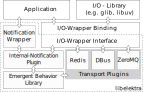

# Notification Tutorial

<!-- FIXME [new_backend]: outdated (global-mount)-->

## Preface

**The features described in this document are experimental.**

This document explains how notifications are implemented in Elektra and how
they can be used by application developers.

## Notifications - Overview & Concept

Elektra's notification feature consists of several components.
While sending and receiving notifications is implemented by plugins,
applications use the notification API in order to use different plugins.

The
[notification API](https://doc.libelektra.org/api/latest/html/group__kdbnotification.html)
implemented by the `elektra-notification` library allows receiving and handling
notifications.
An [I/O abstraction layer](https://doc.libelektra.org/api/latest/html/group__kdbio.html)
allows asynchronous notification processing by compatible plugins.
The abstraction layer consists of an _interface_ used by transport plugins and
different implementations of that interface called _I/O bindings_.
An I/O binding implements the actual I/O management functions for a specific
event loop API.
Applications typically use one I/O binding but can also use none or multiple
I/O bindings.
For more on I/O bindings see the
[API documentation](https://doc.libelektra.org/api/latest/html/group__kdbio.html).

Transport plugins exchange notifications via different protocols like D-Bus or
ZeroMQ.
For each type of transport there are typically two types of plugins: One for
sending and one for receiving notifications.
Developers do not interact with those plugins directly.
The underlying transports are transparent to them.
The "internalnotification" plugin implements notification handling functions and
feeds back configuration changes from within the application.
It is only used internally by the `elektra-notification` library.



When a configuration key is changed Elektra can generate change notifications
that allow applications to process those changes.
Developers can choose whether and how they want to receive and handle those
notifications but not whether notifications are sent or which transport is used.
How notifications are sent is specified in the _notification configuration_ by
the system operator.

## Notification Configuration

System operators can mount the desired transport plugins and configure them
(e.g. set channel, host, port and credentials) globally.

They need to mount both sending and receiving plugins in order to use a
transport.

```sh
kdb global-mount dbus announce=once dbusrecv
```

Plugins usable as transport plugin are marked with `notification` on the
[plugin page](https://www.libelektra.org/plugins/readme#notification-and-logging).

## How to integrate an I/O binding and send notifications asynchronously

Developers do not need to change their programs in order to start sending
notifications.
However without the integration of an I/O binding notifications _may_ be sent
synchronously which would block normal program execution.
For programs without time constraints (e.g. CLI programs) this may not be
important, but for GUIs or network services this will have negative impact.

The "zeromqsend" and "dbus" plugins do not block program execution for sending
as sending is handled asynchronously be the underlying libraries.

The following is a basic example of an application using Elektra extended by
the initialization of an I/O binding.

```C
#include <elektra/kdb.h>
#include <elektra/kdbio.h>
#include <elektra/kdbio/uv.h>

#include <uv.h>

int main (void)
{
	// Create libuv event loop
	uv_loop_t * loop = uv_default_loop ();

	// Initialize I/O binding tied to event loop
	ElektraIoInterface * binding = elektraIoUvNew (loop);

	// Create contract that tells Elektra to use the I/O binding
	KeySet * contract = ksNew (0, KS_END);
	elektraIoContract (contract, binding);

	// Open KDB (with contract)
	Key * key = keyNew ("/sw/myorg/myapp/#0/current", KEY_END);
	KDB * kdb = kdbOpen (contract, key);

	// Normal application setup code ...

	// Start the event loop
	uv_run (loop, UV_RUN_DEFAULT);

	// Cleanup
	ksDel (contract);
	kdbClose (kdb, key);
	elektraIoBindingCleanup (binding);
	uv_loop_close (loop);
}
```

Make sure to compile/link with `pkg-config --libs --cflags elektra-io-uv`.

## How to receive notifications

Since many different I/O management libraries exist (e.g. libuv, glib or libev)
the transport plugins use the I/O interface for their I/O operations.
Each I/O management library needs its own I/O binding.
Developers can also create their own I/O binding for the I/O management library
of their choice.
This is described in the last section.

Each I/O binding has its own initialization function that creates a new
I/O binding and connects it to the I/O management library.
For this tutorial we will assume that libuv 1.x is used.
For details on how to use a specific binding please look at available I/O
bindings on the [bindings page](https://www.libelektra.org/bindings/readme).

In order to handle change notifications a developer can either register a
variable or a callback.

### Register a variable

Values of registered variables are automatically updated when the value of the
assigned key has changed.
In the following example we will register an integer variable.

The following examples are shortened for tangibility. The complete code is available in
["notificationAsync" example](https://www.libelektra.org/examples/notificationasync).

```C
#include <elektra/kdb.h>
#include <elektra/kdbio.h>
#include <elektra/kdbio/uv.h>
#include <elektra/kdbnotification.h>

#include <uv.h>

static void printVariable (ElektraIoTimerOperation * timerOp)
{
	int value = *(int *) elektraIoTimerGetData (timerOp);
	printf ("\nMy integer value is %d\n", value);
}

int main (void)
{
	// Create libuv event loop
	uv_loop_t * loop = uv_default_loop ();

	// Initialize I/O binding tied to event loop
	ElektraIoInterface * binding = elektraIoUvNew (loop);

	// Create contract that tells Elektra to use the I/O binding
	KeySet * contract = ksNew (0, KS_END);
	elektraIoContract (contract, binding);

	// Add notifications to the contract
	elektraNotificationContract (contract);

	// Open KDB
	Key * key = keyNew ("/sw/myorg/myapp/#0/current", KEY_END);
	KDB * kdb = kdbOpen (contract, key);

	// Register "value" for updates
	Key * registeredKey = keyNew ("/sw/myorg/myapp/#0/current/value", KEY_END);
	int value;
	elektraNotificationRegisterInt (kdb, registeredKey, &value);

	// Create a timer to repeatedly print "value"
	ElektraIoTimerOperation * timer = elektraIoNewTimerOperation (2000, 1, printVariable, &value);
	elektraIoBindingAddTimer (binding, timer);

	// Get configuration
	KeySet * config = ksNew(0, KS_END);
	kdbGet (kdb, config, key);
	printVariable (timer);	 // "value" was automatically updated

	// Start the event loop
	uv_run (loop, UV_RUN_DEFAULT);

	// Cleanup
	kdbClose (kdb, key);
	elektraIoBindingRemoveTimer (timer);
	elektraIoBindingCleanup (binding);
	uv_loop_close (loop);
}
```

After calling `elektraNotificationRegisterInt()` the variable `value` will be
automatically updated if the key in the program above is changed by another
program (e.g. by using the `kdb` CLI command).
For automatic updates to work transport plugins have to be mounted globally.

### Callbacks

Registering a variable is suitable for programs where the key's value is simply
displayed or used repeatedly (e.g. by a timer or in a loop).
If an initialization code needs to be redone after configuration changes (e.g. a
value sets the number of worker threads) updating a registered variable will
not suffice.
For these situations a callback should be used.

The following snippet shows how a callback can be used if the value of the
changed key needs further processing.

```C
#include <signal.h>
#include <stdio.h>
#include <string.h>

// from https://en.wikipedia.org/wiki/ANSI_escape_code#Colors
#define ANSI_COLOR_RED			"\x1b[31m"
#define ANSI_COLOR_GREEN		"\x1b[32m"

void setTerminalColor (Key * color, void * context ELEKTRA_UNUSED)
{
	// context contains whatever was passed as 4th parameter
	// to elektraNotificationRegisterCallback()
	char * value = keyString (color);

	if (strcmp (value, "red") == 0)
	{
		printf (ANSI_COLOR_RED);
	}
	if (strcmp (value, "green") == 0)
	{
		printf (ANSI_COLOR_GREEN);
	}
}

int main (void)
{
	KDB * repo;

	// ... initialization of KDB, I/O binding and notifications

	Key * color = keyNew ("/sw/myorg/myapp/#0/current/color", KEY_END);

	// Re-Initialize on key changes
	elektraNotificationRegisterCallback(repo, color, &setTerminalColor, NULL);

	// ... start loop, etc.
}
```

### How-To: Reload KDB when Elektra's configuration has changed

This section shows how the notification feature is used to reload an
application's KDB instance when Elektra's configuration has changed.
This enables applications to apply changes to mount points or globally mounted
plugins without restarting.

**Step 1: Register for changes to Elektra's configuration**

To achieve reloading on Elektra configuration changes we register for changes
below the key `/elektra` using
`elektraNotificationRegisterCallbackSameOrBelow()`.

```C
Key * elektraKey = keyNew ("/elektra", KEY_END);
elektraNotificationRegisterCallbackSameOrBelow (kdb, elektraKey, elektraChangedCallback, NULL))
keyDel (elektraKey);
```

**Step 2: Create a function for reloading KDB**

Since our application needs to repeatedly initialize KDB on
configuration changes we need to create a function which cleans
up and reinitializes KDB.

```C
void initKdb (ElektraIoTimerOperation * timerOp ELEKTRA_UNUSED)
{
	if (kdb != NULL)
	{
		// Cleanup and close KDB
		kdbClose (kdb, parentKey);
	}

	KeySet * contract = ksNew (0, KS_END);
	elektraIoContract (contract, binding);
	elektraNotificationContract (contract);

	kdb = kdbOpen (parentKey);

	// Code for registration from snippet before
	Key * elektraKey = keyNew ("/elektra", KEY_END);
	elektraNotificationRegisterCallbackSameOrBelow (kdb, elektraKey, elektraChangedCallback, NULL);
	keyDel (elektraKey);

	// TODO: add application specific registrations

	// Get configuration
	kdbGet (kdb, config, parentKey);
}
```

**Step 3: Handle configuration changes**

The last step is to connect the registration for changes to the
(re-)initialization function.
Directly calling the function is discouraged due to tight coupling (see
guidelines in the next section) and also results in an application crash since
the notification API is closed while processing notification callbacks.
Therefore we suggest to add a timer operation with a sufficiently small interval
which is enabled only on configuration changes.
This timer will then call the initialization function.

First, we create the timer in the main loop setup of the application.

```C
// (global declaration)
ElektraIoTimerOperation * reload;

// main loop setup (e.g. main())
// the timer operation is disabled for now and
// will reload KDB after 100 milliseconds
reload = elektraIoNewTimerOperation (100, 0, initKdb, NULL);
elektraIoBindingAddTimer (binding, reload);
```

Now we add the callback function for the registration from step 1:

```C
void elektraChangedCallback (Key * changedKey, void * context)
{
	// Enable operation to reload KDB as soon as possible
	elektraIoTimerSetEnabled (reload, 1);
	elektraIoBindingUpdateTimer (reload);
}
```

Finally we disable the timer in the initialization function:

```C
void initKdb (void)
{
	// Stop reload task
	elektraIoTimerSetEnabled (reload, 0);
	elektraIoBindingUpdateTimer (reload);

	if (kdb != NULL)
	{
		// Cleanup notifications and close KDB
		kdbClose (kdb, parentKey);
	}

	// ...
}
```

By correct application of these three steps any application can react to changes
to Elektra's configuration.
The snippets above omit error handling for brevity. The complete code including
error handling is available in the
["notification reload" example](https://www.libelektra.org/examples/notificationreload).
This example also omits globals by passing them as user data using the
`elektraIo*GetData()` functions.

## Emergent Behavior Guidelines

When applications react to configuration changes made by other applications this
can lead to _emergent behavior_.
We speak of emergent behavior when the parts of a system are functioning as
designed but an unintended, unexpected or unanticipated behavior at system level
occurs.

For example, take the following sequence of events:

1. application `A` changes its configuration
2. application `B` receives a notification about the change from `A` and updates its configuration

Given these two steps the sequence could be a case of _wanted_ emergent behavior:
Maybe application `B` keeps track of the number of global configuration
changes.
Now consider adding the following events to the sequence:

3. application `A` receives a notification about the change from `B` and changes its configuration
4. _continue at step 2_

The additional step causes an infinite cycle of configuration updates
which introduces _unwanted_ behavior.

When designing a system it is desirable to use components with predictable and
well-defined behavior.
As a system grows larger and gets more _complex_ unpredictable behavior
emerges that was neither intended by the system designer nor by the designer of
the components.
This system behavior is called _emergent behavior_ if it cannot be explained
from its components but only from analysis of the whole system.

Emergent behavior can be beneficial for a system, for example, useful cooperation
in an ant colony but it also has disadvantages.
Systems that bear _unwanted_ emergent behavior are difficult to manage and
experience failures in the worst case.
This kind of unwanted emergent behavior is called
[_emergent misbehavior_](https://dl.acm.org/doi/10.1145/1217935.1217964).
Examples of emergent misbehavior are traffic jams or the
[Millenium Footbridge](https://researchcourse.pbworks.com/f/structural+engineering.pdf)
[incident in London](https://www.sciencedaily.com/releases/2005/11/051103080801.htm).

An evaluation of Elektra's notification feature shows that it can exhibit the
following symptoms:

- **Synchronization** occurs due to the shared notification medium.
  Multiple applications receive a notification at the same time and execute
  their configuration update logic.
  In turn shared resources like hard disk or CPU become overutilized.
- **Oscillation** occurs when applications are reacting to configuration changes
  by other applications.
- In the worst case oscillation results in **livelock** when the frequency of
  configuration updates becomes so high that applications are only executing
  configuration update logic.
- **Phase change** is a sudden change of the system behavior in reaction to a
  minor change (e.g. incremental change of a configuration setting).
  Phase change is introduced by application logic.

Building on these findings we will now present guidelines for preventing
emergent misbehavior when using the notification API and callbacks in particular.

### Guideline 1: Avoid callbacks

> Most of the guidelines are related to callbacks.
> With normal use of the notification API emergent behavior should not occur.

Callbacks couple an application temporally to configuration changes of other
applications or instances of the same application.
This observation is the basis for [Guidelines 1](#guideline-1-avoid-callbacks),
[2](#guideline-2-wait-before-reacting-to-changes) and [3](#guideline-3-avoid-updates-as-reaction-to-change).
While it is possible with registered variables to check for configuration
changes at regular time intervals and react to changes the coupling is not as
tight as with callbacks.

### Guideline 2: Wait before reacting to changes

> Waiting after receiving a notification decouples an application from changes and reduces the risk for unwanted **_synchronization_**.

In applications where applying changes has impact on resource usage (e.g. CPU or
disk) applying a time delay as suggested by this Guideline is a
sensible choice.
But this guideline is not only limited to these applications.

Generally waiting before reacting to changes reduces the risk for unwanted
synchronization by decoupling the application temporally.
Waiting can be implemented using random time delays which further promotes
decoupling since applications react at different points in time to changes.
Waiting can also be implemented using a flag:
Callbacks set the flag and when the control flow is in the main loop again, the
pending updates are applied and the flag is cleared.

### Guideline 3: Avoid updates as reaction to change

> Avoid changing the configuration as reaction to a change.
> This reduces the risk for unwanted **_oscillation_**.

While this guideline does not forbid updating the key database using `kdbSet()`
in a callback it advises to avoid it.
If we recall the example from before we see how updating as reaction to change
leads to unwanted oscillation.
If necessary, the function `kdbSet()` should be temporally decoupled as
suggested in [Guideline 2](#guideline-2-wait-before-reacting-to-changes).

This guideline applies especially to callbacks but is also relevant when variables
are polled for changes by the application.

### Guideline 4: Do not use notifications for synchronization

> Applications should not use notifications for synchronization as this can lead to **_phase change_**.

This guideline limits the use of the notification API to notifications about
configuration changes.
There are better suited techniques for different use cases.
Applications should not keep track of changes and change their behavior on
certain conditions.

For example, this happens when applications synchronize themselves at startup by
incrementing a counter in the key database.
When a certain limit of application instances is reached the applications
proceed with different behavior.
If this behavior affects other applications phase change has occurred.

### Guideline 5: Apply changes immediately

> Call `kdbSet()` to save updated configuration immediately after a change occurred.
> This reduces conflicting changes in the key database.

When a configuration setting is updated within an application this guideline
suggests to write the change immediately to the key database using `kdbSet()`.
This ensures that other applications have the same view of the key database and
operate on current settings.

### Guideline 6: Be careful on what to call inside callbacks

> Notification callbacks are called from within Elektra.
> Calling `kdbClose()` in a callback will lead to undefined behavior or an application crash.

Closing and cleaning up the KDB handle will cause an application crash because
the control flow returns from the callback to now removed code.
While this can be considered an implementation detail it aligns with
[Guideline 2](#guidline-2-wait-before-reacting-to-changes) since reinitialization of KDB
uses more resources than other operations like `kdbGet()` or `kdbSet()`.

## Logging

In order to analyze application behavior the [logging plugins](https://www.libelektra.org/plugins/readme#notification-and-logging)
can be used with the `get=on` option when mounting:

```sh
kdb global-mount syslog get=on
```

Now both reading from and writing to Elektra's key database is logged.

## How to create your own I/O Binding

Developers can create their own bindings if the I/O management library of their
choice is not supported by an existing I/O binding.

For details on see the [example "doc" binding](/src/bindings/io/doc/) or the
[API documentation](https://doc.libelektra.org/api/latest/html/group__kdbio.html).
Existing I/O bindings provide a good inspiration on how to implement a custom
binding.
Since a binding is generic and not application specific it is much appreciated
if you contribute your I/O binding back to the Elektra Initiative.

## Logging

In order to log and analyze application behavior the logging plugins
["syslog"](https://www.libelektra.org/plugins/syslog),
["journald"](https://www.libelektra.org/plugins/journald) or
["logchange"](https://www.libelektra.org/plugins/logchange) can be used.
In order to log not only `kdbSet()` but also `kdbGet()` the option `log/get=1`
should be used when mounting these plugins.

For example:

```
$ kdb global-mount syslog log/get=1
```
