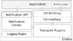

# Notification Tutorial

## Preface

**The features described in this document are experimental.**

This document explains how notifications are implemented in Elektra and how
they can be used by application developers.

## Notifications - Overview & Concept

Elektra's notification feature consists of several components.
While sending and receiving notifications is implemented by plugins,
applications use the notification API in order to use different plugins.

The
[notification API](https://doc.libelektra.org/api/current/html/group__kdbnotification.html)
implemented by the `elektra-notification` library allows receiving and handling
notifications.
An [I/O abstraction layer](https://doc.libelektra.org/api/current/html/group__kdbio.html)
allows asynchronous notification processing by compatible plugins.
The abstraction layer consists of an *interface* used by transport plugins and
different implementations of that interface called *I/O bindings*.
An I/O binding implements the actual I/O management functions for a specific
event loop API.
Applications typically use one I/O binding but can also use none or multiple
I/O bindings.
For more on I/O bindings see the
[API documenation](https://doc.libelektra.org/api/current/html/group__kdbio.html).

Transport plugins exchange notifications via different protocols like D-Bus or
ZeroMQ.
For each type of transport there are typically two types of plugins: One for
sending and one for receiving notifications.
Developers do not interact with those plugins directly.
The underlying transports are transparent to them.
The "internalnotification" plugin implements notification handling functions and
feeds back configuration changes from within the application.
It is only used internally by the `elektra-notification` library.



When a configuration key is changed Elektra can generate change notifications
that allow applications to process those changes.
Developers can choose whether and how they want to receive and handle those
notifications but not whether notifications are sent or which transport is used.
How notifications are sent is specified in the *notification configuration* by
the system operator.

## Notification Configuration

System operators can mount the desired transport plugins and configure them
(e.g. set channel, host, port and credentials) globally.

They need to mount both sending and receiving plugins in order to use a
transport.

```sh
kdb global-mount dbus announce=once dbusrecv
```

Plugins usable as transport plugin are marked with `transport` on the
[plugin page](https://www.libelektra.org/plugins/readme#notification-and-logging).

## How to integrate an I/O binding and send notifications asynchronously

Developers do not need to change their programs in order to start sending
notifications.
However without the integration of an I/O binding notifications *may* be sent
synchronously which would block normal program execution.
For programs without time constraints (e.g. CLI programs) this may not be
important, but for GUIs or network services this will have negative impact.

The "zeromqsend" and "dbus" plugins do not block program execution for sending
as sending is handled asynchronously be the underlying libraries.

The following is a basic example of an application using Elektra extended by
the initialization of an I/O binding.

```C
#include <elektra/kdb.h>
#include <elektra/kdbio.h>
#include <elektra/kdbio_uv.h>

#include <uv.h>

void main (void)
{
  KDB* repo;

  // Open KDB
  Key * key = keyNew ("/sw/myorg/myapp/#0/current", KEY_END);
  KDB * kdb = kdbOpen (key);

  // Create libuv event loop
  uv_loop_t * loop = uv_default_loop ();

  // Initialize I/O binding tied to event loop
  ElektraIoInterface * binding = elektraIoUvNew (loop);

  // Use I/O binding for our kdb instance
  elektraIoSetBinding (kdb, binding);

  // Normal application setup code ...

  // Start the event loop
  uv_run (loop, UV_RUN_DEFAULT);

  // Cleanup
  kdbClose (kdb, key);
  elektraIoBindingCleanup (binding);
  uv_loop_close (loop);
}
```

## How to receive notifications

Since many different I/O management libraries exist (e.g. libuv, glib or libev)
the transport plugins use the I/O interface for their I/O operations.
Each I/O management library needs its own I/O binding.
Developers can also create their own I/O binding for the I/O management library
of their choice.
This is described in the last section.

Each I/O binding has its own initialization function that creates a new
I/O binding and connects it to the I/O management library.
For this tutorial we will assume that libuv 1.x is used.
For details on how to use a specific binding please look at available I/O
bindings on the [bindings page](https://www.libelektra.org/bindings/readme).

In order to handle change notifications a developer can either register a
variable or a callback.

### Register a variable

Values of registered variables are automatically updated when the value of the
assigned key has changed.
In the following example we will register an integer variable.

The following examples are shortened for tangibility. The complete example is available in
[src/libs/notification/example/example_notification_async.c](https://github.com/ElektraInitiative/libelektra/blob/master/src/libs/notification/example/example_notification_async.c).

```C
#include <elektra/kdb.h>
#include <elektra/kdbio.h>
#include <elektra/kdbio_uv.h>
#include <elektra/kdbnotification.h>

#include <uv.h>

static void printVariable (ElektraIoTimerOperation * timerOp)
{
	int value = *(int *) elektraIoTimerGetData (timerOp);
	printf ("\nMy integer value is %d\n", value);
}

void main (void)
{
  KDB* repo;

  // Open KDB
  Key * key = keyNew ("/sw/myorg/myapp/#0/current", KEY_END);
  KDB * kdb = kdbOpen (key);

  // Create libuv event loop
  uv_loop_t * loop = uv_default_loop ();

  // Initialize I/O binding tied to event loop
  ElektraIoInterface * binding = elektraIoUvNew (loop);

  // Use I/O binding for our kdb instance
  elektraIoSetBinding (kdb, binding);

  // Initialize notification wrapper
  elektraNotificationOpen (kdb);

  // Register "value" for updates
  Key * registeredKey = keyNew ("/sw/myorg/myapp/#0/current/value", KEY_END);
  int value;
  elektraNotificationRegisterInt (repo, registeredKey, &value);

  // Create a timer to repeatedly print "value"
  ElektraIoTimerOperation * timer = elektraIoNewTimerOperation (2000, 1, printVariable, &value);
  elektraIoBindingAddTimer (binding, timer);

  // Get configuration
  KeySet * config = ksNew(0, KS_END);
  kdbGet (kdb, config, key);
  printVariable (timer);   // "value" was automatically updated

  // Start the event loop
  uv_run (loop, UV_RUN_DEFAULT);

  // Cleanup
  elektraNotificationClose (kdb);
  kdbClose (kdb, key);
  elektraIoBindingRemoveTimer (timer);
  elektraIoBindingCleanup (binding);
  uv_loop_close (loop);
}
```

After calling `elektraNotificationRegisterInt()` the variable `value` will be
automatically updated if the key in the program above is changed by another
program (e.g. by using the `kdb` CLI command).
For automatic updates to work transport plugins have to be mounted globally.

### Callbacks

Registering a variable is suitable for programs where the key's value is simply
displayed or used repeatedly (e.g. by a timer or in a loop).
If an initialization code needs to be redone after configuration changes (e.g. a
value sets the number of worker threads) updating a registered variable will
not suffice.
For these situations a callback should be used.

The following snippet shows how a callback can be used if the value of the
changed key needs further processing.

```C
#include <signal.h>
#include <stdio.h>
#include <string.h>

// from https://en.wikipedia.org/wiki/ANSI_escape_code#Colors
#define ANSI_COLOR_RED			"\x1b[31m"
#define ANSI_COLOR_GREEN		"\x1b[32m"

void setTerminalColor (Key * color, void * context ELEKTRA_UNUSED)
{
  // context contains whatever was passed as 4th parameter
  // to elektraNotificationRegisterCallback()
  char * value = keyString (color);

  if (strcmp (value, "red") == 0)
  {
    printf (ANSI_COLOR_RED);
  }
  if (strcmp (value, "green") == 0)
  {
    printf (ANSI_COLOR_GREEN);
  }
}

int main (void)
{
  KDB * repo;

  // ... initialization of KDB, I/O binding and notifications

  Key * color = keyNew ("/sw/myorg/myapp/#0/current/color", KEY_END);

  // Re-Initialize on key changes
  elektraNotificationRegisterCallback(repo, color, &setTerminalColor, NULL);

  // ... start loop, etc.
}
```

## Guidelines

TODO

## Logging

In order to analyze application behavior the [logging plugins](https://www.libelektra.org/plugins/readme#notification-and-logging)
can be used with the `get=on` option when mounting:

```sh
kdb global-mount syslog get=on
```

Now both reading from and writing to Elektra's key database is logged.

## How to create your own I/O Binding

Developers can create their own bindings if the I/O management library of their
choice is not supported by an existing I/O binding.

For details on see the [example "doc" binding](/src/bindings/io/doc/) or the
[API documentation](https://doc.libelektra.org/api/current/html/group__kdbio.html).
Existing I/O bindings provide a good inspiration on how to implement a custom
binding.
Since a binding is generic and not application specific it is much appreciated
if you contribute your I/O binding back to the Elektra project.

## Logging

In order to log and analyze application behavior the logging plugins
["syslog"](https://www.libelektra.org/plugins/syslog),
["journald"](https://www.libelektra.org/plugins/journald) or
["logchange"](https://www.libelektra.org/plugins/logchange) can be used.
In order to log not only `kdbSet()` but also `kdbGet()` the option `log/get=1`
should be used when mounting these plugins.

For example:

```
$ kdb global-mount syslog log/get=1
```
