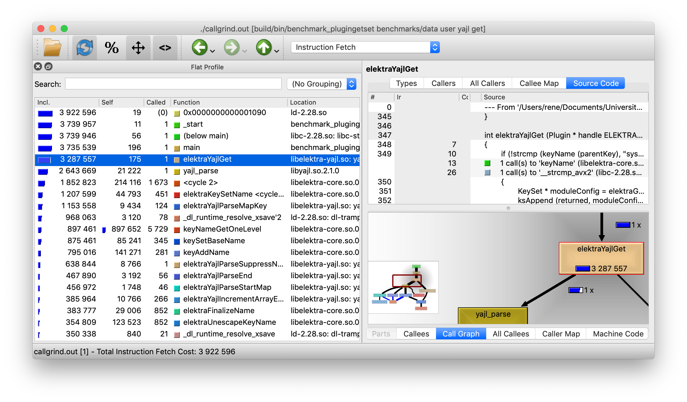

# Profiling

## Execution Time

One of the primary resources in computing is execution time. To keep usage of this resource type low, it makes sense to profile code and check which code paths in a progamm take the longest time to execute. There exist various tools to handle this kind of profiling. For this tutorial we will use [Callgrind](http://valgrind.org/docs/manual/cl-manual.html), and the graphical frontend [KCacheGrind/QCacheGrind](https://kcachegrind.github.io/html/Home.html).

### Choosing the Correct Build Type

Since we want to improve the readability of the Callgrind output we choose a build type that includes debug symbols. The two obvious choices for the build type are:

- `RelWithDebInfo` (optimized build with debug symbols), and
- `Debug` (non-optimized build with debug symbols)

. We use `Debug` here, which should provide the most detailed profiling information.

### Disabling `dlclose` Calls

For this tutorial we decided to profile the [YAy PEG][] plugin. Since Elektra loads plugin code via `dlopen` and Callgrind [does not support the function `dlclose` properly](https://stackoverflow.com/questions/16719395) we remove the `dlclose` calls in the file [`dl.c`](../../src/libs/loader/dl.c) temporarily. At the time of writing one option to do that is deleting

- a single line `dlclose` statement, and
- an `if`-statement that checks the return value of a `dlclose` call

. An unfortunate effect of this code update is that Elektra will now leak memory when it unloads a plugin. On the other hand, Callgrind will be able to add source code information about the [YAy PEG][] plugin to the profiling output.

[yay peg]: ../../src/plugins/yaypeg/README.md

### Building Elektra

As we already described before we use the `Debug` build type for the profiling run. To make sure we test the actual performance of the [YAy PEG][] plugin we disable debug code and the logger. The following commands show one option to translate Elektra using this configuration, if we use [Ninja](https://ninja-build.org) as build tool:

```sh
mkdir build
cd build
cmake -GNinja ..               \
      -DCMAKE_BUILD_TYPE=Debug \
      -DENABLE_LOGGER=OFF      \
      -DENABLE_DEBUG=OFF       \
      -DPLUGINS=ALL
ninja
cd .. # Change working directory back to the root of repository
```

.

### Profiling the Code

We use the tool [`benchmark_plugingetset`](../../benchmarks/README.md) to profile the execution time of [YAy PEG][]. The file [`keyframes.yaml`](https://github.com/ElektraInitiative/rawdata/blob/master/YAML/Input/keyframes.yaml) serves as input file for the plugin. Since `benchmark_plugingetset` requires a data file called

```sh
test.$plugin.in
```

, we save a copy of `keyframes.yaml` as `test.yaypeg.in` in the folder `benchmarks/data`:

```sh
mkdir -p benchmarks/data
curl -L https://github.com/ElektraInitiative/rawdata/raw/master/YAML/Input/keyframes.yaml -o benchmarks/data/test.yaypeg.in
```

. After that we call `benchmark_plugingetset` directly to make sure that everything works as expected:

```sh
build/bin/benchmark_plugingetset benchmarks/data user yaypeg get
```

. If the command above fails with a segmentation fault, then please check

- that the [build system](../COMPILE.md) included [YAy PEG][], and
- that your OS is able to locate the plugin (e.g. append the `lib` directory in the build folder to `LD_LIBRARY_PATH` on Linux)

. If `benchmark_plugingetset` executed successfully, then you can now use Callgrind to profile the command:

```sh
valgrind --tool=callgrind --callgrind-out-file=callgrind.out \
build/bin/benchmark_plugingetset benchmarks/data user yaypeg get
```

. The command above will create a file called `callgrind.out` in the root of the repository. You can now remove the input data and the folder `benchmarks/data`:

```sh
rm benchmarks/data/test.yaypeg.in
rmdir benchmarks/data
```

. If you use [Docker](../../scripts/docker/README.md) to translate Elektra, then you might want to fix the paths in the file `callgrind.out` before you continue:

```sh
# The tool `sponge` is part of the `moreutils` package: https://joeyh.name/code/moreutils
sed -E 's~/home/jenkins/workspace/(\.\./)*~~g' callgrind.out | sponge callgrind.out
```

. Now we can analyze the file `callgrind.out` with a graphical tool such as QCacheGrind:

```sh
qcachegrind&
```

. If everything worked as expected QCacheGrind should open the file `callgrind.out` and display a window that look similar to the one below:



. You can now select different parts of the call graph on the left to check which parts of the code take a long time to execute.
