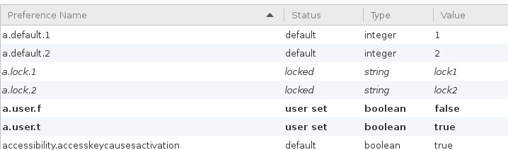
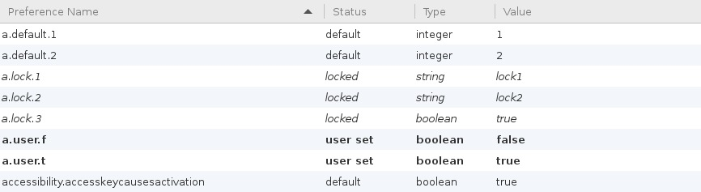

## Introduction

This file explains how Firefox preferences can be manipulated at run-time using Elektra’s intercept open and a custom autoconfig script.

## Basics

`kdb configure-firefox -s` will configure everything needed to get started.

### Files

- `/usr/lib/firefox` / `/usr/lib/firefox-esr`

  - `defaults/pref/autoconfig.js` Loads `elektra.cfg`

    ```
    pref("general.config.filename", "elektra.cfg");
    pref("general.config.obscure_value", 0);
    ```

  - `elektra.cfg` Contains the autoconfig code

- `~/.mozilla/firefox/<profile>/prefs.js` Contains the user preferences. The configure-firefox script will append the config for our autoconfig script:

  ```
  user_pref("elektra.config.file", "/tmp/imnotreal.js");
  user_pref("elektra.config.reload_trigger_port", 65432);
  ```

  Every time the string `reload` is send to localhost:`elektra.config.reload_trigger_port` the autoconfig script will import the preferences from `elektra.config.file`
  <br>
  `elektry.config.file` contains the name of the dummy file for `intercept open`. `open` calls to this file will be intercepted and the content generated by `intercept open`

### Setting Preferences

#### Guided Setup

Running `kdb configure-firefox -a` provides a guided setup for adding http_proxy and homepage preferences.

```
% kdb configure-firefox -a
Add new preferences
Config Setup:

1) Proxy
2) Homepage
0) Exit
1

Setting up HTTP Proxy
1) lock
2) default
3) user
0) Exit
1

Proxy Type
0) No Proxy
1) Manual Setup
2) PAC
4) Auto-detect
5) System Settings
1

Set string to 1
Host/IP: 127.0.0.1
Port: 8080
Setting lockPref HTTP Proxy to 127.0.0.1:8080
```

#### Manual Setup

This example shows how to manually setup a preferences. It's equivalent to the example shown above in the `Guided setup`

```sh
kdb meta set user:/prefs/lock/network/proxy/type type integer
kdb set user:/prefs/lock/network/proxy/type 1
kdb meta set user:/prefs/lock/network/proxy/http type string
kdb set user:/prefs/lock/network/proxy/http 127.0.0.1
kdb meta set user:/prefs/lock/network/proxy/http_port type integer
kdb set user:/prefs/lock/network/proxy/http_port 8080
```

### Test Setup

Running `kdb configure-firefox -t` will set up some test values.

```sh
kdb export /preload
#> [open]
#> \/tmp\/imnotreal.js =
#> \/tmp\/imnotreal.js/generate = user:/prefs
#> \/tmp\/imnotreal.js/generate/plugin = mozprefs

kdb export user:/prefs
#> [lock/a/lock]
#> 1 = lock1
#> 2 = lock2
#> [pref/a/default]
#> 1 = 1
#> 2 = 2
#> [user:/a/user]
#> f = false
#> t = true

kdb export user:/prefs mozprefs
#> lockPref("a.lock.1", "lock1");
#> lockPref("a.lock.2", "lock2");
#> pref("a.default.1", 1);
#> pref("a.default.2", 2);
#> user_pref("a.user.f", false);
#> user_pref("a.user.t", true);
```

```sh
kdb elektrify-open firefox-esr "about:config"
```



```sh
kdb meta set user:/prefs/lock/a/lock/3 type boolean
kdb set user:/prefs/lock/a/lock/3 true
kdb export user:/prefs
#> [lock/a/lock]
#> 1 = lock1
#> 2 = lock2
#> 3 = true
#> [pref/a/default]
#> 1 = 1
#> 2 = 2
#> [user:/a/user]
#> f = false
#> t = true
```



## Limitations

Changing locked values doesn't work without restarting.
