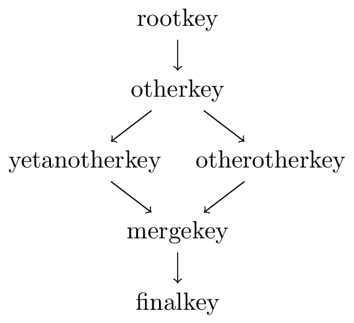

# Example: Alternative references

For this example the following configuration is used:

```ini
; this example uses the ni plugin syntax
; 1. metadata
[rootkey/ref]
check/reference = recursive

[otherkey/newref]
check/reference = alternative

; 2. configuration data
rootkey/ref/#0 = ../otherkey

otherkey/ref/#0 = ../yetanotherkey
otherkey/newref/#0 = ../otherotherkey

otherotherkey/ref/#0 = ../nonexistent
otherotherkey/newref/#0 = ../mergekey

yetanotherkey/ref/#0 = ../mergekey
yetanotherkey/newref/#0 = ../nonexistent

mergekey/ref/#0 = ../finalkey
mergekey/newref/#0 = ../finalkey

finalkey = ""
```

We mount it by executing:

```sh
cat << EOF > alternative.ini
; this example uses the ni plugin syntax
; 1. metadata
[rootkey/ref]
check/reference = recursive

[otherkey/newref]
check/reference = alternative

; 2. configuration data
rootkey/ref/#0 = ../otherkey

otherkey/ref/#0 = ../yetanotherkey
otherkey/newref/#0 = ../otherotherkey

otherotherkey/ref/#0 = ../nonexistent
otherotherkey/newref/#0 = ../mergekey

yetanotherkey/ref/#0 = ../mergekey
yetanotherkey/newref/#0 = ../nonexistent

mergekey/ref/#0 = ../finalkey
mergekey/newref/#0 = ../finalkey

finalkey = ""
EOF

kdb mount alternative.ini user/tests/reference/alternative ni reference
```

The file contains a specification, which marks `user/tests/reference/alternative/rootkey/ref` 
as our root reference key and `user/tests/reference/alternative/otherkey/newref` as an 
alternative reference.

The actual configuration contains then a structure which is processed by the plugin like follows:

1. `user/tests/reference/alternative/rootkey/ref/#0` is read and its reference validated.
2. `user/tests/reference/alternative/otherkey/ref/#0` is read and its reference validated.
2. `user/tests/reference/alternative/otherkey/newref` is discovered as an alternative reference and stored for later.
3. `user/tests/reference/alternative/yetanotherkey/ref/#0` is read and its reference validated.
4. `user/tests/reference/alternative/mergekey/ref/#0` is read and its reference validated.
5. `user/tests/reference/alternative/finalkey` does not contain a reference, so we stop here.
6. Processing of the alternative reference chain from `user/tests/reference/alternative/otherkey/newref` starts.
7. `user/tests/reference/alternative/otherkey/newref/#0` is read and its reference validated.
8. `user/tests/reference/alternative/otherotherkey/newref/#0` is read and its reference validated.
9. `user/tests/reference/alternative/mergekey/newref/#0` is read and its reference validated.
10. `user/tests/reference/alternative/finalkey` does not contain a reference, so we stop here.

The resulting reference graph looks like this:



As you can see, the plugin completely ignores `user/tests/reference/alternative/yetanotherkey/newref` as well as
`user/tests/reference/alternative/otherother/ref` and in turn does not throw an error because 
`user/tests/reference/alternative/nonexistent` does not exist. However, the plugin does still exhaustively check
both of the alternative reference chains. If you want to prohibit this, you can set the metakey 
`check/reference/restrict` to an empty value on whichever key you want to be a leaf node in the graph.

After we are done we can unmount the example with:
```sh
kdb umount user/tests/reference/alternative
```